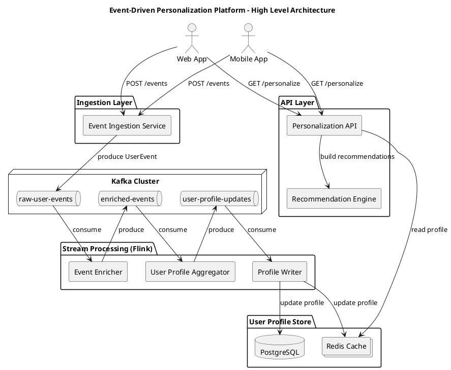

# **Event‑Driven Personalization Platform**

A production‑grade, event‑driven system for real‑time user personalization.  
The platform ingests user events, processes them through a streaming pipeline (Apache Flink + Kafka), builds dynamic user profiles, and exposes personalized recommendations via a REST API.

This project demonstrates **Senior Backend/Data Engineering** skills:  
distributed systems, streaming architectures, stateful processing, scalable APIs, and clean modular design.

---

# 🚀 **Architecture Overview**

The system consists of five major layers:

### **1. Ingestion Layer**

Receives raw user events from clients and publishes them to Kafka.

### **2. Event Backbone (Kafka)**

Acts as the central event bus with three topics:

- `raw-user-events`
- `enriched-events`
- `user-profile-updates`

### **3. Stream Processing Layer (Apache Flink)**

Three independent jobs:

- **Event Enricher** → enriches raw events
- **User Profile Aggregator** → maintains per‑user state
- **Profile Writer** → persists profiles to Redis/Postgres

### **4. Profile Store**

- **Redis** → fast access for API
- **PostgreSQL** → persistent storage

### **5. Personalization API**

Reads user profiles and returns personalized recommendations.

---

# 🧩 **High‑Level Architecture Diagram**



---

# 📡 **Event Flow (End‑to‑End)**

1. Client sends `UserEvent` → Ingestion Service
2. Ingestion publishes to Kafka (`raw-user-events`)
3. Flink Enricher → produces `EnrichedEvent`
4. Flink Aggregator → updates per‑user state → emits `UserProfileUpdated`
5. Flink Writer → stores profile in Redis + Postgres
6. API reads profile → returns recommendations

---

# 🧬 **Data Model**

### **UserEvent**

```json
{
  "eventId": "uuid",
  "userId": "string",
  "eventType": "VIEW",
  "timestamp": 1714060800000,
  "context": {
    "page": "home",
    "itemId": "item001",
    "category": "TECH",
    "device": "MOBILE",
    "geo": "USA"
  }
}
```

### **EnrichedEvent**

```json
{
  "eventId": "uuid",
  "userId": "string",
  "eventType": "VIEW",
  "timestamp": 1714060800000,
  "context": {...},
  "enrichment": {
    "categoryVector": ["TECH"],
    "deviceType": "MOBILE",
    "geoRegion": "APAC"
  }
}
```

### **UserProfileUpdated**

```json
{
  "userId": "user123",
  "updatedAt": 1714060800000,
  "profile": {
    "interests": { "tech": 3.0 },
    "recentItems": ["item001"],
    "activityScore": 0.3
  }
}
```

---

# 🧱 **Project Structure (Maven Multi‑Module)**

```
platform-parent/
├─ core-model/
├─ ingestion-service/
├─ streaming-event-enricher/
├─ streaming-profile-aggregator/
├─ streaming-profile-writer/
├─ personalization-api/
├─ infra/
└─ docs/
```

Each module is fully isolated and production‑ready.

---

# 🐳 **Local Development (Docker)**

Start Kafka, Redis, Postgres:

```
cd infra
docker-compose up -d
```

---

# 🛠️ **Build All Modules**

```
mvn clean install -DskipTests
```

---

# ▶️ **Run Services**

### Ingestion Service

```
cd ingestion-service
mvn spring-boot:run
```

### Personalization API

```
cd personalization-api
mvn spring-boot:run
```

### Flink Jobs

```
java -jar streaming-event-enricher/target/*.jar
java -jar streaming-profile-aggregator/target/*.jar
java -jar streaming-profile-writer/target/*.jar
```

---

# 🧪 **Testing the Pipeline**

### Send a test event

```
curl -X POST http://localhost:8081/events \
  -H "Content-Type: application/json" \
  -d '{"userId":"user123","eventType":"VIEW","timestamp":1714060800000,
       "context":{"page":"home","itemId":"item001","category":"tech","device":"mobile","geo":"de"}}'
```

### Request personalization

```
curl "http://localhost:8080/api/v1/personalize?userId=user123&limit=5"
```

---

# 🎯 **What This Project Demonstrates**

This platform showcases:

### **Backend Engineering**

- Clean modular architecture
- REST API design
- Redis/Postgres integration

### **Data Engineering**

- Kafka event modeling
- Stateful stream processing (Flink)
- Real‑time profile aggregation

### **Distributed Systems**

- Event‑driven architecture
- Horizontal scalability
- Loose coupling between services

### **Production‑readiness**

- Dockerized infra
- Multi‑module Maven build
- Clear separation of concerns

---

# 📄 **License**

MIT / Apache‑2.0 (choose one)
